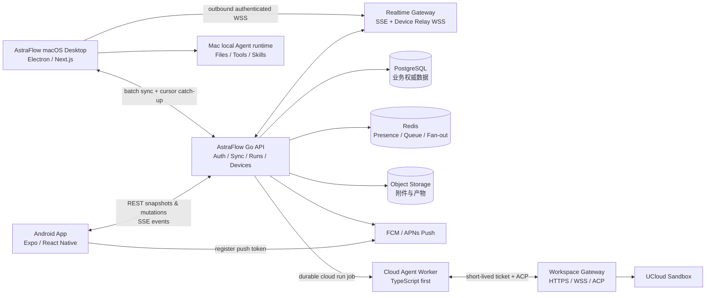

# AstraFlow Mac + Android 跨设备 Agent App 规划

状态：Implemented baseline / Phase 0–5 代码已落地，Phase 6 按规划暂缓  
日期：2026-07-19  
范围：现有 macOS Electron Desktop、Android 原生 App、AstraFlow Go API、UCloud Agent Sandbox / Workspace Gateway

## 1. 结论

本项目不应把现有 macOS Desktop 重写成 React Native，也不应让手机直接访问电脑或 Sandbox 的长期凭证。建议形成三个明确层次：

1. **macOS Desktop 保持现有 Electron + Next.js 架构**，继续负责本机文件、系统权限、本地 Agent runtime 和桌面 UI。
2. **新增 `mobile-app/`，使用 React Native + Expo + Expo Router + TypeScript**，Android 首发，技术上保留以后支持 iOS 的能力。
3. **Go 后端升级为跨设备控制面和云端数据权威源**，负责账号、设备、会话、消息、Run、事件、审批、产物、同步游标和审计；执行仍分布在 Mac Desktop 或云端 Sandbox。

产品入口采用和 WorkBuddy 类似、但更清晰的双执行目标：

- **云端工作**：手机直接发起任务，由云端 Agent Worker 连接 Sandbox Workspace Gateway 执行，不依赖 Mac 在线。
- **连接 Mac**：手机把任务经后端中继给用户自己的 Mac，使用 Desktop 已有的本机文件、工具、Skills 和 Agent runtime；Mac 必须在线。

首版“控制电脑”定义为 **Agent 任务级远控**：发任务、看进度、追问、审批、停止、收文件。屏幕画面、鼠标和键盘级远程桌面属于另一套产品与安全模型，不放入 MVP。

## 2. 平台和代码策略

### 2.1 为什么 Android 采用 React Native + Expo

React Native 官方对新项目推荐使用 Expo；Expo Router 提供 Android、iOS 和 Web 的文件路由、原生导航与 Deep Link。这个选择能复用团队的 React/TypeScript 经验、业务枚举、生成的 TypeScript API 类型和设计 token。

移动端能共享的是：

- OpenAPI 生成客户端和 DTO；
- AgentEvent / message part 语义；
- Models、Skills、Experts、渠道能力策略；
- Zod 校验、错误码、埋点事件名和设计 token。

移动端不能直接共享的是：

- Next.js Server Component 和 Route Handler；
- shadcn/Radix DOM 组件；
- Electron IPC、Node.js 文件系统和本机进程能力；
- 依赖浏览器 DOM 的 Markdown、终端和文件预览组件。

### 2.2 macOS 不进入本次 React Native 改写

React Native macOS 是 Microsoft 维护的 out-of-tree 平台，需要单独初始化 macOS 工程，并不是 Expo Android/iOS 工程的自然输出。现有 Desktop 已经拥有成熟的 Electron、SQLite、Agent、文件、PTY、渠道和 Sandbox 能力，重写会延迟跨设备功能，且不能消除后端同步工作。

因此本规划中的“跨端”是共享产品协议与云端状态，而不是强行共享所有 UI 代码：

```text
macOS:   Electron + Next.js + TypeScript
Android: React Native + Expo + TypeScript
Backend: Go/Kratos + PostgreSQL + Redis
Runtime: Workspace Gateway + ACP + Agent runtimes
```

如果未来明确要求“原生 macOS 重写”，应单独立项评估 React Native macOS 或 SwiftUI，不和 Android MVP 绑定。

## 3. 当前项目可复用基础与真实缺口

### 3.1 已有基础

| 能力 | 当前实现 | 在新架构中的用途 |
| --- | --- | --- |
| 本地会话和消息 | `lib/studio-db/` SQLite | 迁移为 Desktop 本地缓存和离线 outbox |
| Agent 统一事件 | `lib/agent/events.ts` | 作为云端 Run 事件 payload 的语义基础 |
| Run 编排与快照 | `lib/agent/run-orchestrator.ts` | Desktop 执行端继续复用；抽取云端 Worker 能力 |
| 前台流式更新 | `/api/studio/chat/events` SSE | 参考其状态投影，不直接作为跨设备公网协议 |
| 手机渠道远控 | `lib/mobile-channels/` | 已验证手机发任务、审批、停止和文件回传的产品路径 |
| Sandbox 工作区 | `studio_workspaces` + `sandbox_id` | 云端执行目标的工作区句柄 |
| Workspace Gateway | HTTPS/WSS、一次性 ticket、PTY、ACP | 手机云端任务的数据面和 runtime 接入层 |
| Go API | Kratos、PostgreSQL、Redis、proto/OpenAPI | 新的账号、同步、设备和 Run 控制面 |
| OpenAPI codegen | `bun run codegen:astraflow-api` | Desktop 和 Android 唯一 HTTP contract 来源 |

现有的移动渠道功能不是要被删除的旧方案。微信、飞书、钉钉、Telegram 等仍然可以作为轻量通知和任务入口；原生 App 提供完整历史、富消息、设备选择、审批、产物和离线恢复。

### 3.2 关键缺口

1. 会话、消息、Run、Agent 事件和文件元数据目前主要存于 Desktop SQLite，Go 后端还不是跨设备数据权威源。
2. Go API 当前主要提供专家、市场、渠道、Feedback 和 Analytics，没有用户设备、会话同步、Run 和产物 contract。
3. 当前 Desktop 登录状态服务于本机应用，缺少可供原生 App 和设备中继共同使用的服务端账号/session 模型。
4. Workspace Gateway 已能启动远程 ACP runtime，但云端 Run 的 ACP client 和 AgentEvent 投影仍由 Desktop TypeScript 代码承担。
5. 当前 SSE 是进程内 live snapshot；它没有 durable `seq`、跨进程重放和移动端后台恢复能力。
6. Desktop 缺少“本地事务 + 同步 outbox + 服务端 cursor”的可靠同步层。
7. 当前 Go HTTP timeout 配置为 15 秒。长连接 SSE/WSS 不能未经设计直接塞进现有请求生命周期。

## 4. WorkBuddy 参考结论

WorkBuddy 公开资料中最值得借鉴的不是某个聊天气泡，而是执行环境和任务生命周期：

- 手机入口同时提供“云上模式”和“本机模式”；
- 本机模式由电脑实际提供本地文件、Shell、凭证、插件和工具；
- 手机可以发起、追问、中断任务，并查看拆解步骤；
- 任务完成或需要审批时，手机收到通知；
- 支持文字、语音、图片和文件输入，以及产物分享；
- 自动化、Skills、专家和项目管理是第二层扩展能力。

AstraFlow 应进一步避免两个限制：

- 不把所有远程指令压进一个永久会话；继续保留多会话、归档、固定和项目/Workspace 绑定。
- 不把“在线连接”当作历史记录；后端必须先持久化 Run 和事件，再向在线客户端广播。

## 5. 目标架构



### 5.1 控制面和数据面

**Go API 是控制面：**

- 验证用户、租户、设备和执行目标；
- 创建 Run、分配执行 lease、保存状态和事件；
- 决定任务发给某台 Mac 还是云端 Worker；
- 管理 Sandbox/Workspace 元数据、配额、审计和推送；
- 给执行端签发短期、最小 scope 的凭证。

**执行端是数据面：**

- Mac Desktop 执行本机任务；
- Cloud Agent Worker 连接 Workspace Gateway 执行云端任务；
- Workspace Gateway 只负责贴近 Workspace 的文件、Git、PTY、进程和 Agent runtime；
- 执行端不得成为跨设备会话历史的唯一存储。

### 5.2 为什么云端先保留 TypeScript Agent Worker

当前 AgentRuntime、AgentEvent、ACP adapter、权限和 rich message 投影已经在 TypeScript 中成熟。第一版把它们全部重写成 Go，既容易造成语义分叉，也会推迟 Android。

建议新增一个无 UI 的 TypeScript Cloud Agent Worker：

- 从 Redis Streams 或可靠任务队列领取 Go API 已持久化的 Run；
- 通过短期 ticket 连接 Workspace Gateway / ACP；
- 复用或抽取现有 Agent adapter 和 AgentEvent 映射；
- 把事件按序写回 Go API；
- 不持有用户会话权威数据，不直接对公网提供产品 API。

Go 仍是唯一公开控制面。后续只有在性能、部署或团队维护上有明确收益时，再逐步把 Worker 能力迁移到 Go。

## 6. 两种执行模式

### 6.1 云端工作

```text
Mobile create run
  -> Go API 保存 run(status=queued, target=cloud)
  -> 队列投递 run_id
  -> Cloud Agent Worker 领取 lease
  -> 恢复/连接长期 Sandbox
  -> 通过 Workspace Gateway 启动或恢复 ACP session
  -> AgentEvent 写回 Go API
  -> PostgreSQL 提交 event(seq=N)
  -> Realtime Gateway 广播给 Mobile/Desktop
  -> 完成、失败或待审批时发送 Push
```

约束：

- App 退到后台或退出，Run 仍然继续；
- Sandbox 暂停/恢复不更换稳定的 `sandbox_id`；
- 每个 Workspace 同一时间默认只允许一个写 Run；只读 Run 是否并发后续再开放；
- Worker 丢失 lease 后，只有在幂等和 runtime session 状态可确认时才能接管。

### 6.2 连接 Mac

```text
Mac 启动并登录
  -> 向 Realtime Gateway 建立出站 WSS
  -> 上报 device presence 和 capabilities

Mobile create run(target=desktop, device_id=...)
  -> Go API 保存 run 和 device command
  -> Relay 推送 command
  -> Mac 以 command_id 幂等接收并 ACK lease
  -> Desktop 使用现有 startStudioChatRun() 执行
  -> AgentEvent / snapshot 增量写回后端
  -> 后端持久化后广播到 Mobile
```

关键规则：

- Mac 不开放公网监听端口；只建立向云端的出站 TLS 连接。
- `online` 只代表设备通道在线，不代表某个 Workspace 可用；能力和 Workspace 状态需要单独上报。
- 同一个 `command_id` 可能因网络重试投递多次，Desktop 必须只执行一次。
- Mac 离线时，用户可以选择“等待 Mac 上线”或改为云端 Workspace；后端不能静默改变执行环境。
- Desktop 本地高风险操作继续走现有 permission gateway；手机审批是同一个服务端 action 的另一个 UI。

## 7. 数据权威与同步模型

### 7.1 哪些数据上云

| 数据 | 权威位置 | 同步策略 |
| --- | --- | --- |
| 用户、设备、会话、消息、Run、审批 | PostgreSQL | 全量云端权威，客户端本地缓存 |
| Agent durable events | PostgreSQL | append-only、按 Run `seq` 排序 |
| 会话标题、归档、固定、偏好 | PostgreSQL | server version + 乐观并发 |
| 附件与产物二进制 | Object Storage | PostgreSQL 只存 metadata、hash、owner 和 retention |
| 云端 Workspace 元数据 | PostgreSQL | `workspace_id` 稳定绑定 `sandbox_id` |
| 云端 `/workspace` 文件 | 长期 Sandbox，后续可备份 | 不通过普通会话同步复制整棵文件树 |
| Mac 本机项目文件 | 用户 Mac | 默认不上云；只上传用户明确附加或要求回传的文件 |
| API Key、OAuth refresh token、渠道 secret | Keychain/服务端 secret store | 不进入普通 sync event 和客户端日志 |
| UI 临时状态 | 客户端 | 不同步或只同步显式用户偏好 |

“实时同步 Desktop 数据”不等于把 Desktop SQLite 原样上传。应同步稳定的领域实体和事件，禁止同步本机绝对路径、任意环境变量、`.env`、终端原始历史和未授权项目文件。

### 7.2 Desktop outbox/inbox

Desktop 在同一个 SQLite 事务中写业务变更和 `sync_outbox`：

```text
local mutation
  -> update local projection
  -> insert sync_outbox(client_mutation_id, entity, operation, payload)
  -> background batch upload
  -> backend deduplicate + commit
  -> mark outbox acknowledged
```

建议新增本地表：

```text
sync_outbox
sync_cursors
sync_inbox_dedup
device_command_dedup
```

后端返回服务端 `version` 和 `cursor`。Desktop 再通过 cursor 拉取其他设备产生的变化，更新本地 projection。

### 7.3 服务端事件和恢复

跨设备事件使用一个稳定 envelope，现有 `AgentEvent` 放在 `payload` 中：

```json
{
  "schema_version": 1,
  "event_id": "evt_...",
  "account_id": "acct_...",
  "aggregate_type": "agent_run",
  "aggregate_id": "run_...",
  "seq": 42,
  "event_type": "agent.tool.updated",
  "occurred_at": "2026-07-19T10:00:00Z",
  "producer": {
    "type": "desktop",
    "id": "device_..."
  },
  "payload": {}
}
```

必须同时维护：

- `seq`：Run 内严格递增，用于富消息重放；
- `cursor`：账号同步流中的不透明位置，用于客户端 catch-up；
- `client_mutation_id`：写请求幂等；
- `command_id`：设备命令幂等；
- `entity_version`：可编辑 metadata 的乐观并发。

连接恢复：

1. 客户端保存最后持久化的 `cursor` 和各活动 Run 的 `seq`；
2. 前台重连先拉 snapshot/catch-up，再订阅 live stream；
3. live stream 只做低延迟通知，不承担唯一持久化；
4. 重放窗口不足时，服务端返回 `resync_required`，客户端获取新 snapshot；
5. 手机后台不维持永久 socket，完成/失败/审批使用 Push 唤醒用户。

### 7.4 冲突规则

- 消息和 Agent 事件：append-only，不做 LWW 覆盖。
- 会话重命名、归档、固定：以服务端 `entity_version` 做 compare-and-swap。
- 审批：只允许 `pending -> approved | denied | expired` 一次原子转换。
- Run：每个 session 默认只允许一个 `queued | running | waiting_input` Run。
- 删除：先写 tombstone，保留恢复和其他客户端同步窗口，再按 retention 清理。
- 时间：排序使用服务端接收时间和序号，不信任设备时钟。

## 8. 通信协议分工

不要用一条 WebSocket 承载全部功能：

| 协议 | 用途 |
| --- | --- |
| REST/JSON + OpenAPI | 登录交换、设备/会话 CRUD、mutation batch、snapshot、事件补拉、Run action |
| SSE 或 NDJSON stream | Mobile/Desktop 前台订阅账号和 Run 的服务端事件 |
| WSS device relay | Mac presence、命令下发、ACK、心跳和执行事件上行 |
| WSS Workspace Gateway | Worker/Desktop 到 ACP runtime、PTY 和 workspace live events |
| Push | App 后台时的完成、失败、审批、用户输入和设备掉线通知 |
| WebRTC（后续） | 仅用于真正的屏幕、音频或低延迟远程桌面 |

SSE/NDJSON 与 WSS 都必须基于持久化 cursor/seq 恢复，不能只依赖内存 listener。

## 9. 后端领域模型草案

首轮 PostgreSQL migration 建议覆盖以下实体。字段最终以 proto/OpenAPI 和 migration 为准：

```text
accounts
account_id, ucloud_subject, tenant_id, status, created_at, updated_at

devices
id, account_id, type, name, platform, app_version,
protocol_version, capabilities, public_key, last_seen_at, revoked_at

push_endpoints
id, account_id, device_id, provider, token_ciphertext, locale, enabled

projects
id, account_id, name, source_type, repo_metadata, created_at, updated_at

workspaces
id, project_id, type(local_ref|sandbox), sandbox_id,
gateway_protocol_version, state, owner_device_id, created_at, updated_at

sessions
id, account_id, workspace_id, mode, title, runtime_id, model,
reasoning_effort, permission_mode, version, pinned_at, archived_at,
created_at, updated_at, deleted_at

messages
id, session_id, role, status, content_projection, parts_projection,
client_mutation_id, created_at, updated_at

agent_runs
id, session_id, execution_target, target_device_id, workspace_id,
status, runtime_session_ref, lease_owner, lease_expires_at,
last_event_seq, started_at, completed_at, error_code, error_message

agent_run_events
run_id, seq, event_id, type, payload, producer_type, producer_id, created_at

agent_actions
id, run_id, event_seq, type(permission|user_input), status,
request_payload, resolution_payload, version, expires_at, resolved_at

artifacts
id, account_id, session_id, run_id, kind, file_name, mime_type,
size, sha256, object_key, source_device_id, retention_until, created_at

device_commands
id, account_id, device_id, run_id, type, payload, status,
attempts, lease_expires_at, created_at, acknowledged_at, completed_at

sync_events
cursor, account_id, aggregate_type, aggregate_id, event_type,
entity_version, payload, created_at

client_mutations
account_id, device_id, client_mutation_id, result, created_at
```

Redis 只用于 presence、短期路由、fan-out、rate limit 和队列，不作为消息、Run 或审批的唯一存储。

## 10. API contract 草案

所有 HTTP request/response DTO 都先在 backend proto 中定义，生成 OpenAPI，再运行 `bun run codegen:astraflow-api`。Desktop 和 Android 不手写重复 DTO。

### 10.1 账号与设备

```text
POST /api/v1/auth/native/exchange
POST /api/v1/devices
GET  /api/v1/devices
GET  /api/v1/devices/{device_id}
POST /api/v1/devices/{device_id}/revoke
POST /api/v1/devices/{device_id}/connection-token
POST /api/v1/push-endpoints
```

移动 App 使用系统浏览器 + OAuth PKCE + Android App Link 接收回调。客户端包里的 shared secret 不能作为机密。UCloud OAuth Bearer token 和 ProjectId 解析继续遵守现有 OAuth-first 约束，不引入 AK/SK 旁路。

### 10.2 同步与会话

```text
POST /api/v1/sync/mutations/batch
GET  /api/v1/sync/snapshot
GET  /api/v1/sync/events?after={cursor}&limit={n}
GET  /api/v1/sessions
POST /api/v1/sessions
GET  /api/v1/sessions/{session_id}
PATCH /api/v1/sessions/{session_id}
POST /api/v1/sessions/{session_id}/messages
```

### 10.3 Run 和交互

```text
POST /api/v1/agent-runs
GET  /api/v1/agent-runs/{run_id}
GET  /api/v1/agent-runs/{run_id}/events?after_seq={seq}
POST /api/v1/agent-runs/{run_id}/cancel
POST /api/v1/agent-runs/{run_id}/approvals/{action_id}
POST /api/v1/agent-runs/{run_id}/user-input/{action_id}
```

### 10.4 文件和产物

```text
POST /api/v1/uploads
POST /api/v1/uploads/{upload_id}/complete
GET  /api/v1/artifacts/{artifact_id}
POST /api/v1/artifacts/{artifact_id}/share
DELETE /api/v1/artifacts/{artifact_id}/share
```

大文件使用短期签名 URL、分片/断点续传和 hash 校验，不通过 Go API 或 WSS 直接中继整个文件。

## 11. Realtime Gateway 与设备身份

### 11.1 设备注册

1. Desktop 使用现有 UCloud 登录完成账号认证；
2. Desktop 生成设备密钥对，私钥放 Electron `safeStorage`/macOS Keychain；
3. 后端保存 public key、设备信息和 capability manifest；
4. 每次连接先获取短期 connection token，再完成 challenge 签名；
5. 用户可以在 Android 或 Desktop 查看并撤销设备。

### 11.2 Desktop capability manifest

```json
{
  "protocol_version": 1,
  "platform": "darwin-arm64",
  "app_version": "1.5.2",
  "capabilities": {
    "local_agent": true,
    "local_files": true,
    "workspace_gateway": true,
    "runtime_ids": ["astraflow", "codex", "claude", "opencode"],
    "screen_control": false
  }
}
```

Runtime 具体版本只用于诊断；兼容性继续由协议和 capability 决定，不能要求 Desktop、Gateway 和 Sandbox patch/minor 版本完全相等。

## 12. Android App 产品结构

### 12.1 首版页面

```text
登录 / App Link 回调
设备与执行环境选择
新建任务
任务历史
任务详情 / 富消息流
审批与用户输入
附件上传 / 相机 / 语音
产物预览、下载与分享
Models
SKILLS
设置 / 推送 / 安全 / 设备撤销
```

新任务页应把执行目标放在输入框附近，并持续显示，不藏在深层设置中：

```text
[ 云端 Sandbox ▾ ]  或  [ 我的 MacBook Pro · 在线 ▾ ]
```

切换目标时展示能力差异，例如“可访问 Mac 本地文件”“Mac 离线后任务无法开始”“云端任务可在后台继续”。不能在发送后静默切换。

### 12.2 富消息结构

移动端继续按 message parts 渲染，不把所有内容塞进 Markdown：

```text
Text / Markdown
Reasoning summary
Plan / Progress
Tool call / Tool result
Permission approval
User input request
File change summary
Artifact
Image / Video
Subagent
Error / Retry
```

长对话使用 FlashList；服务器数据缓存使用 TanStack Query 一类的 query layer；token 存 SecureStore；会话、事件和 outbox 缓存存 SQLite。具体 UI 基础可从 React Native Reusables 或 gluestack-ui 选一个做 spike，但组件源码由项目掌控。

### 12.3 后台行为

- 前台：订阅 live event stream，50–100 ms 合并渲染 delta，避免每个 token 触发完整列表刷新；
- 后台：断开长流，不承诺维持 WebSocket；
- 完成、失败、审批和提问：后端发 Push；
- 打开通知：Deep Link 到 `run_id`，先按 `seq` 补拉，再恢复 live stream；
- 离线：允许查看缓存、写草稿；“发送任务”需要明确在线或进入可见待发送状态。

## 13. Desktop 改造顺序

不要先重写整个 SQLite 层。采用双写迁移：

1. 给会话、消息、Run、事件补齐跨设备稳定 ID 和服务端映射字段；
2. 新增 outbox/cursor/dedup 表和后台 `SyncCoordinator`；
3. 在现有 create/update transaction 中追加 outbox；
4. 接入 Desktop 出站 Device Relay；
5. 先同步新建会话和新 Run，不立刻上传全部历史；
6. 提供显式的历史导入/迁移批次，带进度、可暂停和重试；
7. 稳定后把云端数据作为权威源，SQLite 退为缓存和本机专属状态。

移动消息渠道绑定、渠道 secret、local project path 等 Desktop 专属表不直接迁入云端通用会话 schema。

## 14. 真正的远程桌面：独立二期

“通过手机控制电脑”有两个容易混淆的定义：

| 能力 | MVP | 技术 |
| --- | --- | --- |
| 用自然语言让 Mac Agent 操作文件和工具 | 是 | Device Relay + Desktop Agent runtime |
| 在手机看 Mac 屏幕并操作鼠标键盘 | 否，独立二期 | macOS native host + ScreenCaptureKit + CGEvent/Accessibility + WebRTC |

屏幕级远控需要额外处理：

- macOS Screen Recording 和 Accessibility/TCC 授权；
- 视频编码、网络穿透、TURN、中继成本和弱网控制；
- 端到端加密、会话可见指示器、一次性确认和自动超时；
- 键盘、剪贴板、文件传输和多显示器；
- App Store/隐私合规与企业策略。

它不能复用 Workspace Gateway 的文件/ACP ticket 来“顺便实现”，也不能默认无人值守。建议在 Agent 任务级远控稳定后再做技术 spike。

## 15. 安全和隐私底线

1. 所有跨设备实体强制绑定 `account_id`/tenant，服务端每次查询都做 owner scope。
2. Mac 只出站连接，不给家庭网络开放入站端口，也不把本机 Next.js API 暴露公网。
3. Device、Run、Workspace ticket 全部短期、可撤销、scope-limited；禁止长期 token 出现在 URL、日志和普通 sync payload。
4. 后端先持久化 command/event 再广播；在线通道不能绕过审计。
5. 审批需要展示执行目标、设备、Workspace、工具和关键参数；审批 token 绑定 action version，防止旧卡片批准新操作。
6. 手机丢失后可从 Desktop/管理端撤销 device 和 push endpoint。
7. 本机文件默认不上云；附件上传必须由用户动作或明确 Agent 工具调用触发，并记录来源和 hash。
8. Artifact signed URL 短期有效；分享链接与账号下载链接分离，可撤销并有 retention。
9. 远端 Agent 继续受 workspace path、symlink、网络和 permission policy 约束。
10. 日志和分析事件不保存 prompt、文件内容、token、终端原文或模型私密 reasoning。

## 16. 分阶段路线图

### Phase 0：协议冻结与端到端 spike

目标：先证明一条完整链路，不做大规模 UI。

- 定义 `SyncEventEnvelope`、Run 状态机、execution target、device capability 和错误码；
- 用 Go API 创建 Run，并持久化 20–50 条带 `seq` 的模拟 AgentEvent；
- Android spike 能按 `after_seq` 断线重连；
- Mac 建立出站 WSS，接收一个幂等 ping/task command；
- 验证 Kubernetes Gateway/Ingress 的 SSE、WSS、心跳和 idle timeout。

完成标准：断开网络、重连、重复投递和 App 退后台后，不丢事件、不重复执行。

### Phase 1：账号、设备与同步底座

- 增加 PostgreSQL migration、proto、OpenAPI 和生成客户端；
- 原生 OAuth PKCE、设备注册/撤销、push endpoint；
- Desktop SQLite outbox/cursor/dedup；
- session/message metadata 的双向同步；
- Realtime Gateway presence 和 durable catch-up。

完成标准：Desktop 新建会话后 Android 数秒内可见；Android 重命名/归档后 Desktop 收敛一致。

### Phase 2：连接 Mac 的任务级远控 MVP

- Mobile 选择 Mac、Workspace、runtime、model 和 permission mode；
- Device command lease、ACK、重试和幂等；
- Desktop 执行现有 Run，并把 normalized events 上行；
- 手机显示文本、计划、工具、审批、用户输入、停止和最终文件；
- Mac 离线、退出、睡眠和重连状态明确。

完成标准：手机可在真实 Mac 项目上发起任务、审批一次高风险操作、停止任务并下载产物；任何重试都不会重复启动 Run。

### Phase 3：云端 Sandbox 执行 MVP

- 抽取 Cloud Agent Worker；
- Go API 管理 Workspace/Sandbox、Run queue 和 lease；
- Worker 通过 Workspace Gateway / ACP 执行；
- 手机退出后 Run 继续，Push 通知结果；
- Sandbox pause/auto-resume 和 runtime session resume。

完成标准：Mac 完全离线时，Android 仍能完成一个包含文件生成、工具调用和审批的云端任务。

### Phase 4：产物、多模态和离线体验

- 相机、图片、文件、语音输入；
- 对象存储、断点上传、预览、下载和可撤销分享；
- SQLite 缓存、草稿、事件压缩和历史分页；
- FCM/APNs Push 和通知 Deep Link。

完成标准：弱网、后台和进程被杀场景可恢复，产物有明确权限和过期策略。

### Phase 5：产品能力补齐

- Models、SKILLS、Experts/专家团；
- Automation 远程查看与云端创建；
- 设备能力矩阵、用量和错误诊断；
- 微信/飞书等现有渠道与原生 App 共用同一云端 session/run，而不是各自生成孤岛历史。

### Phase 6：屏幕级远控可行性验证（可选）

- 单独威胁模型和合规评审；
- macOS native capture/input host；
- WebRTC + TURN spike；
- 明确无人值守策略后再决定是否产品化。

## 17. 上线门槛

- 账号隔离、跨租户访问、撤销设备和过期 ticket 测试通过；
- Run/event/message 均有幂等键和恢复游标；
- Desktop 重启、Mac 睡眠、Android 后台、网络切换、Redis 重启不丢 durable state；
- `seq` 缺失、重复、乱序、长时间断线和 `resync_required` 有自动化测试；
- 手机审批无法批准已变化、已过期或属于另一设备/Run 的 action；
- 本机未授权文件和 secret 不进入后端、对象存储、Push 或 analytics；
- Sandbox Gateway 协议和 capability 不兼容时显式阻止执行；
- Go API contract 变化均由 proto/OpenAPI 生成客户端，未手写重复 payload 类型；
- Android 长列表、流式 Markdown、键盘、附件和恢复达到可用性能；
- 关键指标可观测：command delivery、run queue latency、first event latency、reconnect rate、push delivery、duplicate suppression。

## 18. 首轮必须冻结的决策

| 决策 | 默认建议 |
| --- | --- |
| macOS 技术栈 | 保留 Electron/Next.js，不随 Android 重写 |
| Android 技术栈 | React Native + Expo Development Build + Expo Router |
| 云端权威源 | PostgreSQL；SQLite 仅缓存和本机专属状态 |
| 执行目标 | `cloud` 与 `desktop(device_id)` 显式选择 |
| 云端执行层 | Go 控制面 + TypeScript Cloud Agent Worker + Workspace Gateway |
| 前台事件 | durable REST catch-up + SSE/NDJSON live stream |
| Mac 通道 | Desktop 主动建立的 authenticated WSS |
| 文件同步 | metadata/显式附件/产物；不镜像整个本机项目 |
| 冲突模型 | append-only event + entity version CAS + tombstone |
| 手机后台 | Push 唤醒 + seq/cursor 恢复，不依赖常驻 socket |
| “远控”首版含义 | Agent 任务级远控，不含屏幕/鼠标/键盘 |

## 19. 实施状态（2026-07-19）

本规划的 Phase 0–5 已在同一仓库形成可部署的端到端代码基线；Phase 6 屏幕、鼠标和键盘级远控仍按原决策保持关闭，所有设备 capability 都明确上报 `screen_control: false`。

| 规划能力 | 已落地实现 |
| --- | --- |
| 云端权威数据与同步 | `0009`–`0012` PostgreSQL migration；账号、设备、Workspace、Session、Message、Run、事件、Action、Artifact、Push、Automation 和 sync cursor/outbox contract |
| Go 控制面 | 账号隔离的 REST/gRPC 服务、原生 OAuth PKCE、同步快照/增量、durable SSE、Run/Action 状态机、模型目录、对象存储签名 URL、Push dispatcher 和 Automation scheduler |
| Mac 执行与同步 | Desktop SQLite outbox/cursor/dedup、后台 SyncCoordinator、一次性令牌 + Ed25519 的出站 WSS、命令 lease/ACK/重试、真实本机 Workspace Agent 执行和事件上行 |
| 本机文件保护 | 本机项目默认不上云；只有 Run 显式开启“回传产物”时才上传本次产生的普通文件，并执行 realpath/symlink/secret/大小/数量边界检查 |
| 云端执行 | 独立 TypeScript Cloud Agent Worker、Workspace provisioning、Run lease/heartbeat、Workspace Gateway + ACP、审批/输入恢复、取消和输出 Artifact 上传 |
| Android App | Expo SDK 57 + Expo Router；Models、SKILLS 为前两项导航；登录、任务、设备、富消息、审批/输入、取消、附件/相机/语音、离线 outbox/cache、产物下载/分享/撤销、Experts、Automations、Push 诊断和单 Run token/cost 用量展示 |
| 多入口共享历史 | Desktop、Android 与微信/飞书等 Desktop 渠道共用后端 Session/Run；本地渠道 Run 使用 `local_origin`，不再生成孤岛历史 |
| 交付与部署 | Desktop/Android 双 OpenAPI codegen、Cloud Worker Dockerfile、Helm Deployment/Secret 配置、EAS profiles 和数据库/后端/Worker/Android 部署说明 |

实现保持以下边界：

- 云端 Sandbox、ModelVerse、对象存储、Expo Push 和 UCloud OAuth 需要部署环境提供真实服务端凭证；代码不会把这些凭证写进移动端或普通同步事件。
- Marketplace 当前公开详情只提供 `SKILL.md` 时，移动端会把真实说明带入任务；依赖额外 bundle 文件的 SKILL 仍需由对应 runtime 的安装/资源能力提供，App 不伪造缺失文件。
- 用量展示来自 runtime 上报的 Run usage；没有上报时不估算 token 或费用，也不冒充账户账单/配额。
- 本轮没有执行生产 migration、发布镜像或 EAS build；这些是 [DEPLOY.md](../DEPLOY.md) 中需要部署凭证和环境授权的发布动作。

已执行的实现验证包括：

```text
go test ./...
go test -race ./internal/biz ./internal/data ./internal/server
bun run typecheck
bun run lint
bun run mobile:typecheck
bun run mobile:lint
bun test tests/desktop-return-artifacts.test.ts
bun run test:cross-device-sync
buf generate + Desktop/Mobile OpenAPI codegen + Wire
Helm template（cloudWorker.enabled=true）
Cloud Worker 模块导入 smoke
git diff --check
```

## 20. 参考资料

- [WorkBuddy 手机端公众号文章（用户提供）](https://mp.weixin.qq.com/s/A-6GG_RMw-q-qVSaZ9L7yw)
- [WorkBuddy 小程序简介：云上模式与本机模式](https://www.codebuddy.cn/docs/workbuddymini/quick-start/Overview)
- [WorkBuddy 任务执行、步骤拆解与中断](https://www.codebuddy.cn/docs/workbuddymini/features/Task-Execution)
- [WorkBuddy 助理：手机远程任务与电脑端执行](https://www.workbuddy.cn/docs/workbuddy/From-Beginner-to-Expert-Guide/Function-Description/Assistant)
- [WorkBuddy 微信客服号：跨设备接续与本地电脑能力](https://www.workbuddy.cn/docs/workbuddy/Wechat-Guide)
- [WorkBuddy App 发布信息：连接电脑与云端工作](https://www.ithome.com/0/978/468.htm)
- [React Native 官方：新项目使用 Expo](https://reactnative.dev/docs/environment-setup)
- [Expo Router 官方介绍](https://docs.expo.dev/router/introduction/)
- [React Native macOS 官方介绍](https://microsoft.github.io/react-native-macos/docs/intro)
- [AstraFlow 远程 Sandbox 架构](./research/internal-remote-code-sandbox-architecture.md)
- [AstraFlow Agent Runtime 平台架构](./agent-runtime-replatform.md)
- [AstraFlow 移动渠道接入说明](./mobile-channels-global-providers.md)
