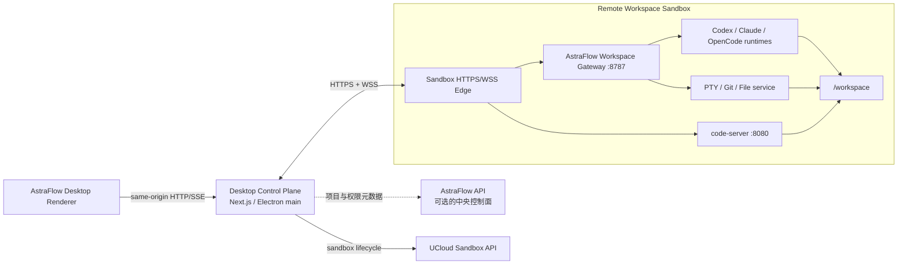

# AstraFlow 内部版：远程代码沙箱架构方案

状态：Implementing

日期：2026-07-14

工作分支：`codex/remote-code-sandbox`

实现进度（2026-07-14）：Phase 0 的 HTTPS/WSS 工作区切片已落地。仓库已包含
独立 Workspace Gateway、受认证的 health/workspace/file HTTP API、PTY WSS、
一次性 WebSocket ticket、Desktop auto-resume 连接入口和
`smoke:codebox-auto-resume` 验证脚本。Studio 右侧目录、文件预览和终端均已迁移到
Sandbox Gateway，Electron 本机 `node-pty` 和侧栏工作区文件 IPC 已移除。
`astraflow-code` 模板已成功发布（template `yeyb5hbs2kweus6ku07l`，build
`89fbdc09-a94a-4f85-9244-a1006318e332`）。真实 Sandbox 的多轮
pause/resume 持久性 smoke 仍需选择一个无活动任务的 Sandbox 执行。Phase 3
的公开 ACP runtime 通路已在源码和模板中落地：Codex、Claude Code 和 OpenCode
通过一次性票据连接 Gateway WebSocket，并在 Sandbox 内启动。Desktop 开发版已
连接真实 Sandbox，三个 runtime 均完成 `pwd` 命令 smoke 并返回 `/workspace`。

## 1. 结论

内部版应采用“桌面控制面 + 沙箱工作面”的架构：

- AstraFlow Desktop 保留产品 UI、账号状态、会话编排和沙箱生命周期控制。
- 每个远程工作区运行在独立的 UCloud Sandbox 中。
- 沙箱内同时运行 `code-server` 与一个精简的 `AstraFlow Workspace Gateway`。
- 文件、Git、终端、Agent、进程、预览和文件监听能力全部由 Gateway 通过 HTTPS/WSS 提供。
- 项目和 Workspace 仍是产品层实体；每个 Workspace 绑定一个长期 Sandbox，Sandbox 文件系统同时承担运行环境与主持久化。
- `sandboxId` 是 Workspace 的稳定资源句柄，但不能替代项目名称、仓库来源、分支、权限等产品元数据。
- 不建议把完整的 AstraFlow Next.js 服务和 SQLite 数据库原样复制进每个 code-server 沙箱。

这里的“注入”应当拆成两部分：

1. 构建模板时，把版本固定的 Workspace Gateway、Agent runtime、code-server 和扩展烘焙进镜像或模板快照。
2. 创建沙箱时，只注入当前工作区配置、短期访问凭证和仓库初始化信息。

## 2. 为什么不直接把完整 Desktop 服务塞进沙箱

当前 Electron 会在本机启动完整 Next.js 服务，并把 SQLite、文件库、Skills、Python runtime 和本地沙箱目录放在 Electron `userData` 下。相关入口在：

- `electron/main.cjs`
- `lib/studio-db/connection.ts`
- `lib/studio-file-storage.ts`
- `lib/studio-chat-runner.ts`

把完整服务复制到每个远程沙箱虽然能暂时复用本地路径逻辑，但会产生以下问题：

| 问题 | 影响 |
| --- | --- |
| 每个沙箱都有一份 SQLite | 会话、设置、凭证和项目状态分裂，无法形成稳定控制面 |
| Electron 能力在沙箱中不存在 | 文件夹选择、系统打开、Electron IPC、本机 PTY 等逻辑仍需重写 |
| Next 服务从 loopback 变成公网服务 | 当前认证、安全存储和同源假设不再成立 |
| 安装包过大 | 完整 Electron/Next runtime、媒体能力和无关依赖会重复进入每个沙箱 |
| 升级难以兼容 | Desktop 与沙箱内完整服务可能同时存在多个版本，数据库和路由容易漂移 |
| 全局任务被错误复制 | 移动渠道、媒体任务、账号配置等不属于某个代码工作区 |

因此，应提取“需要靠近工作区执行”的能力形成 Workspace Gateway，而不是复制整个产品服务。

## 3. 当前代码已经具备的基础

仓库并非从零开始，现有代码已经包含较完整的远程沙箱原型：

- `sandbox_template/code/`：code-server 沙箱模板，包含 Node.js、Git、Agent CLI 和扩展。
- `lib/codebox-runtime.ts`：沙箱创建、暂停、恢复、销毁、仓库 clone、code-server、远程 PTY、SSH 和凭证注入。
- `app/api/codebox/`：CodeBox HTTP/SSE 路由。
- `components/codebox/`：远程沙箱管理、终端和打开 code-server 的 UI。
- `lib/astraflow-session-sandbox.ts`：按会话创建和恢复远程执行沙箱。
- `runtime/astraflow-acp/`：在 Gateway workspace 内通过 Pi Agent 工具执行命令和文件操作。

当前实现与目标架构之间的主要差距是：

1. Studio 会话已通过 Gateway 使用远程工作区，但 CodeBox 与 Studio 尚未统一为稳定的 Remote Workspace 产品实体。
2. Studio 项目仍由 `studio_local_projects.path` 表示本机绝对路径。
3. Codex、Claude Code 和 OpenCode 的 ACP remote transport 已发布并完成真实
   Sandbox smoke；旧 Sandbox 仍需从新模板重新创建才能获得 Gateway runtime 能力。
4. Studio 目录、文件预览和终端已远程化；项目选择、Git/review 和文件编辑写回仍需完成 Remote transport 迁移。
5. CodeBox 将沙箱记录与项目概念混在一起，没有稳定的远程 Workspace 实体。
6. CodeBox API 当前没有统一调用 `requireAuthenticatedRequest()`，不能直接作为公网服务暴露。
7. CodeBox 会把 ModelVerse、GitHub 凭证写入沙箱文件和 `/etc/profile.d`，需要改为短期、可撤销的凭证模型。
8. `lib/codebox-runtime.ts` 同时承担 provider SDK、凭证、Git、code-server、SSH、终端和数据库职责，需要先拆边界。

## 4. 目标拓扑



第一阶段仍让 Renderer 请求本机同源的 Desktop 服务，由 Desktop 服务连接远程 Gateway。不要让 Renderer 持有 ModelVerse API Key、GitHub token、Sandbox API Key 或 Gateway 长期密钥。

未来如果需要纯 Web 版本，可以在中央控制面增加同源反向代理或一次性连接票据，而不改变 Gateway 协议。

## 5. 核心实体

### 5.1 Remote Project

产品层面的长期项目，包含仓库来源、默认分支、所有者和策略。项目元数据不随 Sandbox 状态变化而消失；但某个 Workspace 的工作副本和未提交文件属于它绑定的长期 Sandbox，显式删除该 Sandbox 会同时删除这份工作副本。

建议字段：

```text
id
owner_id
name
repo_url
default_branch
credential_ref
created_at
updated_at
```

### 5.2 Remote Workspace

项目的一份可编辑工作副本。一个项目可以有主工作区，也可以为任务或分支创建临时工作区。

建议字段：

```text
id
project_id
branch
workspace_path
sandbox_id
template_version
gateway_protocol_version
status                 provisioning | starting | running | pausing | paused | resuming | lost | error | deleting
created_at
updated_at
last_used_at
```

### 5.3 Persistent Workspace Sandbox

Workspace 的长期远程容器，同时承载计算和 `/workspace` 文件系统。正常生命周期中保持 `sandbox_id` 不变：空闲时暂停，下一次访问时自动恢复。它不是可以静默替换的无状态计算节点。

```text
sandbox_id
workspace_id
provider
region
template_id
gateway_port
code_server_port
state
started_at
last_resumed_at
last_heartbeat_at
```

Gateway 和 code-server 的访问 URL、短期票据应在每次 `Sandbox.connect()` 后重新解析，不能作为持久字段缓存。

### 5.4 Studio Session

现有 `studio_sessions.project_id` 最终应改为引用 Workspace，而不是本机 `studio_local_projects.path`。迁移期可增加 `workspace_id`，保留旧字段用于对外版兼容。

## 6. Workspace Gateway 的职责

Gateway 只拥有靠近代码工作区执行的能力：

- 工作区文件读取、写入、搜索、上传、下载和监听。
- Git status、diff、branch、commit、pull、push 等操作。
- 远程 PTY 和进程生命周期。
- Agent runtime 启动、停止、恢复、权限请求和事件流。
- 代码预览所需的文件元数据与 HTTP Range 读取。
- 工作区健康检查、版本协商和审计事件。

Gateway 不拥有：

- UCloud OAuth 登录和产品级账号状态。
- 全局聊天历史与跨项目会话目录。
- Skill 市场、Models 页面和产品配置。
- 移动渠道连接。
- 全局媒体库和非工作区媒体任务。
- 沙箱创建、计费和所有权决策。

这些仍属于 Desktop 或中央 AstraFlow API 控制面。

## 7. HTTP 与 WebSocket 协议

### 7.1 HTTP 适合的能力

HTTP 用于可重试、可审计、请求响应式操作：

| Endpoint | 用途 |
| --- | --- |
| `GET /v1/health` | 协议、Gateway、模板和 runtime 版本协商 |
| `GET /v1/workspace` | 当前 Workspace、仓库和路径信息 |
| `GET /v1/fs/entries` | 目录列表 |
| `GET /v1/fs/search` | 文件搜索 |
| `GET /v1/fs/file` | 文本或二进制文件读取，支持 Range |
| `PUT /v1/fs/file` | 带版本条件的文件写入 |
| `POST /v1/fs/uploads` | multipart/chunk 文件上传 |
| `GET /v1/git/status` | Git 状态摘要 |
| `GET /v1/git/diff` | diff、文件变更和统计 |
| `POST /v1/git/operations` | checkout、commit、pull、push 等受控操作 |
| `POST /v1/terminals` | 创建远程 PTY，返回 `terminalId` |
| `DELETE /v1/terminals/:id` | 关闭 PTY |
| `POST /v1/agent/runs` | 创建 Agent run，返回 `runId` |
| `POST /v1/agent/runs/:id/cancel` | 取消 run |
| `POST /v1/agent/runs/:id/permissions/:requestId` | 回答权限请求 |
| `POST /v1/agent/runs/:id/user-input/:requestId` | 回答 Agent 用户问题 |

所有修改型请求应支持 `Idempotency-Key`，避免断线重试造成重复 commit、重复启动 run 或重复写入。

### 7.2 WebSocket 适合的能力

建议保留两类 WSS 通道：

1. `/v1/ws/events`：复用一条控制连接，承载 Agent、文件监听、操作进度、权限和生命周期事件。
2. `/v1/ws/terminals/:terminalId`：每个 PTY 一条二进制友好的连接，避免大终端输出阻塞 Agent 事件。

控制事件统一使用版本化 envelope：

```json
{
  "v": 1,
  "type": "agent.event",
  "channel": "agent:run_123",
  "streamId": "run_123",
  "seq": 42,
  "requestId": null,
  "timestamp": "2026-07-13T12:00:00.000Z",
  "payload": {}
}
```

首版至少支持：

```text
connection.ready
connection.error
workspace.state
fs.changed
git.changed
operation.progress
agent.event
agent.permission.request
agent.user_input.request
agent.completed
terminal.exit
```

### 7.3 重连与恢复

- 每条逻辑 stream 单独维护递增 `seq`。
- Desktop 保存每条 stream 已消费的最后一个 `seq`。
- 重连时发送 `resume`，Gateway 重放有界事件缓存。
- Agent 的关键事件同时持久化到现有 provider event 存储，不能只依赖内存 ring buffer。
- 如果重放窗口已过期，Gateway 返回 `resync_required`，Desktop 通过 HTTP 拉取 run snapshot、Git 状态和文件树增量。
- 心跳只判断连接健康，不能把 WebSocket 在线等同于沙箱或 Agent 仍在运行。

### 7.4 Remote Connection Manager

Desktop 侧应增加一个进程级 `RemoteWorkspaceConnectionManager`，而不是让每个 React 组件自行连接 Gateway。一个 Workspace 在同一个 Desktop 进程中最多维护一条控制 WSS，终端连接按需附加。

建议接口：

```ts
interface RemoteWorkspaceConnection {
  workspaceId: string
  state: RemoteConnectionState
  request<T>(request: RemoteHttpRequest): Promise<T>
  subscribe(filter: RemoteEventFilter, listener: RemoteEventListener): () => void
  openTerminal(input: OpenTerminalInput): Promise<RemoteTerminalChannel>
  reconnect(): Promise<void>
  close(): Promise<void>
}
```

连接状态机：

```text
disconnected
  -> resolving        查询 Workspace 与稳定 sandbox_id
  -> resuming         Sandbox.connect 并按需自动恢复
  -> connecting       解析最新 endpoint，建立 HTTPS/WSS
  -> authenticating   token 与版本握手
  -> ready
  -> degraded         HTTP 可用但事件流断开
  -> reconnecting
  -> ready | lost | failed
```

Connection Manager 负责：

- 从 Workspace 解析稳定的 `sandboxId` 和协议版本；连接成功后再解析最新 Gateway endpoint。
- 在访问 Gateway 前调用 `Sandbox.connect(sandboxId)`；paused Sandbox 由 provider 自动恢复。
- `SANDBOX_NOT_FOUND` 时把 Workspace 标记为 `lost/error`，禁止透明创建替代 Sandbox，以免把空工作区伪装成原工作区。
- 获取和轮换短期连接 token。
- 复用 WSS、分发事件、维护 `seq` 和执行重放。
- 对 HTTP 请求做超时、幂等重试和错误归一化。
- 通过引用计数管理多个 Studio tab 对同一 Workspace 的使用。
- 将连接状态暴露给 UI，区分“沙箱启动中”“网络重连中”“Agent 仍在运行”等状态。

统一错误码至少包括：

```text
AUTH_EXPIRED
SANDBOX_PAUSED
SANDBOX_NOT_FOUND
GATEWAY_UNAVAILABLE
GATEWAY_INCOMPATIBLE
RESYNC_REQUIRED
WORKSPACE_BUSY
PATH_OUTSIDE_WORKSPACE
CONTENT_VERSION_CONFLICT
OPERATION_ALREADY_RUNNING
```

### 7.5 远程边界

“所有能力基于 HTTP/WebSocket”指所有跨 Desktop 与 Workspace 的调用都走 HTTPS/WSS。首版仍可以保留现有 Renderer 到本机 Next.js 的同源 API/SSE，这一层只作为 BFF 和协议适配器；它不能再直接读取项目文件或启动本地 Agent。

这样可以先复用现有 UI 数据流，又能保证真正执行代码的边界已经完全远程化。后续 Renderer 直连 Gateway 时，只需替换 transport，不需要再次改文件、Git、终端和 Agent 的业务协议。

## 8. Agent runtime 迁移方式

当前公开的 Codex、Claude Code 和 OpenCode runtime 已统一走 ACP：Desktop
保留 ACP client、权限交互、用户输入和 MCP bridge，Gateway 使用一次性票据
建立 WebSocket，并在 Sandbox 内启动对应 stdio ACP adapter。远程连接时
Desktop 不再声明本机 FS/terminal capability，避免 Agent 回调访问 Desktop
文件系统；Agent 直接使用 Sandbox 内的工作区和命令工具。

### Codex

Gateway 启动 `codex-acp`，并显式将其绑定到模板内固定版本的 Codex CLI。
`codex-direct` 仍是本机调试用的非公开 runtime，不用于 Sandbox workspace。

### Claude

Gateway 启动 `claude-agent-acp`，并显式使用模板内固定版本的 Claude Code
executable。`claude-native` 仍是本机调试用的非公开 runtime。

### OpenCode

Gateway 直接启动 `opencode acp` 的 stdio transport，不暴露 OpenCode 原生 HTTP
端口。`opencode-native` 仍是本机调试用的非公开 runtime。

### AstraFlow / Pi Agent

现在的内置远程 runtime 由 Gateway 启动 `runtime/astraflow-acp/`，在 workspace 内本地执行 Pi 文件/shell 工具，并继续使用统一权限网关和 AgentEvent 协议，避免同一 workspace 同时存在两套执行通路。

## 9. code-server 与 Gateway 的打包

建议新增独立运行时目录，例如：

```text
runtime/workspace-gateway/
├── src/
├── protocol/
├── scripts/
└── package.json
```

模板中的目标布局：

```text
/opt/astraflow/workspace-gateway/
/opt/astraflow/runtime-manifest.json
/etc/astraflow/
/run/astraflow/
/workspace/
```

构建原则：

- Gateway 和六个 Agent runtime 依赖遵守根 `package.json` 的精确版本策略。
- 模板、code-server、Gateway、Agent CLI 和 VSIX 都必须记录确定版本或 SHA-256。
- 不要继续在模板中执行未指定版本的 `npm install -g @openai/codex ...`。
- 不要依赖可变基础镜像 tag；发布模板时记录镜像 digest 和模板 ID。
- Gateway 暴露 `/v1/health`，返回 `protocolVersion`、`gatewayVersion`、`templateVersion` 和 runtime versions。
- Desktop 遇到不兼容版本应明确阻止连接，而不是带着未知协议继续运行。

建议用 supervisor 管理两个长期服务：

```text
code-server       127.0.0.1:8080 或 provider 暴露端口
workspace-gateway 127.0.0.1:8787 或受保护的 provider 暴露端口
```

模板可以预启动一个处于 `awaiting_bootstrap` 状态的 Gateway。沙箱创建后，控制面写入一次性 bootstrap 配置并激活服务。这样重依赖已在模板快照中就绪，而用户凭证不会进入模板层。

## 10. 持久化策略

### 10.1 长期 Sandbox 即持久化 Workspace

首版不依赖 Sandbox Volume。创建 Remote Workspace 时只创建一次长期 Sandbox，并把该 Sandbox 的 `/workspace` 作为工作副本的权威存储。空闲后 Sandbox 可以暂停；后续 `Sandbox.connect(sandboxId)` 触发自动恢复，继续使用原文件系统、进程环境和 `sandboxId`。

现有 `lib/codebox-runtime.ts` 已使用这一生命周期基线：

```ts
lifecycle: {
  onTimeout: { action: "pause", keepMemory: true },
  autoResume: true,
}
```

因此持久化的关键不再是额外挂载 Volume，而是保证 Workspace 与 Sandbox 的稳定一对一绑定，并杜绝正常流程中的误销毁。

### 10.2 持久化契约

- Workspace 创建成功后持久保存唯一 `sandbox_id`，正常运行、暂停、恢复和 Desktop 重启都不得更换。
- `/workspace` 是该 Workspace 的权威工作树；文件 API、Git、PTY、Agent 和 code-server 必须共享这一路径。
- 访问 Workspace 时先通过 provider 连接 Sandbox。暂停期间 Gateway HTTP/WSS 不可用属于正常状态，自动恢复完成后再建立连接。
- 窗口关闭、退出登录、Desktop 升级、网络断开和空闲超时均不得调用 `kill`。空闲只进入 `pause`，也可以交给已配置的 timeout 自动暂停。
- 重复 pause/resume 和 Desktop 进程重启必须保留 committed、dirty 与 untracked 文件。
- `sandbox_id` 查无记录时不得自动创建同名替代品；这属于持久工作区丢失，需要显式进入恢复流程。

### 10.3 删除与可选备份

`kill` 等同于删除 Workspace 的主持久化数据，只能由用户显式执行“删除工作区”触发，并需要清晰确认。删除后 Project 元数据可以保留，但原 Sandbox 中未推送、未导出的内容不可恢复。

Git push、下载导出或未来的对象存储备份可作为灾难恢复增强，但不是首版 Workspace 正常运行和恢复的前置条件，也不能替代长期 Sandbox 文件系统。

## 11. 生命周期

### 创建

```text
create RemoteWorkspace
  -> Sandbox.create(template, metadata, network policy, lifecycle.autoResume = true)
  -> 持久化 workspace.sandbox_id
  -> 写入 bootstrap 配置
  -> clone/bootstrap /workspace
  -> 启动 Gateway 与 code-server
  -> 等待 health + version handshake
  -> 标记 running
```

### 空闲暂停

```text
idle policy satisfied
  -> 用生命周期锁停止接受新 run
  -> 确认没有活动 run、PTY 或受管进程
  -> pause sandbox，或等待 timeout 自动 pause
  -> 标记 Workspace paused
```

### 恢复

```text
connect Workspace
  -> Sandbox.connect(workspace.sandbox_id)
  -> provider 自动 resume 原 Sandbox
  -> 等待 Gateway health
  -> 轮换连接凭证
  -> WSS resume(lastSeq)
```

### Sandbox 丢失

```text
connect failed / NotFound
  -> 标记 Workspace lost/error
  -> 明确提示原工作副本不可用
  -> 如仓库有远端，用户可显式选择“从仓库创建新 Workspace”
  -> 不得透明替换 sandbox_id，不承诺恢复未推送内容
```

### 显式删除

```text
delete Workspace requested
  -> 确认 Sandbox 数据会被永久删除
  -> 可选 push/export
  -> Sandbox.kill(workspace.sandbox_id)
  -> 删除 Workspace 记录或保留审计墓碑
```

## 12. 安全边界

1. Gateway 的公网入口默认关闭匿名流量；优先使用 Sandbox 的受保护 traffic 模式或控制面反向代理。
2. code-server 官方明确不建议在无认证、无加密的情况下直接暴露公网。内部版应使用 TLS，并规划统一 SSO；密码认证只能作为过渡。
3. Desktop Renderer 不持有长期 Sandbox、ModelVerse 或 GitHub 密钥。
4. Desktop 到 Gateway 使用短期、workspace-scoped、可撤销的 token；token 至少包含 `workspaceId`、`sandboxId`、scope、过期时间和 nonce。
5. WebSocket 握手同样必须认证。浏览器直连时不能依赖普通自定义 `Authorization` header；优先由 Desktop/BFF 建立上游连接，或交换 Secure HttpOnly cookie/一次性 ticket。
6. GitHub 凭证应优先采用短期 GitHub App installation token，不应长期写入 `/etc/git-credentials`。
7. ModelVerse 凭证只注入需要它的 Agent 子进程，避免写入全局 shell profile。
8. 文件 API 必须执行根目录限制、symlink 逃逸检查、大小限制和原子写入。
9. Gateway 不允许客户端传任意宿主路径；所有路径均为 `/workspace` 下的 POSIX 相对路径。
10. Agent 权限审批仍由 Desktop 交互确认，Gateway 只执行带有效审批结果的操作。
11. 所有 Git mutation、命令、凭证轮换和高风险文件写入应记录审计事件。

## 13. 现有模块迁移映射

| 当前模块 | 内部版目标 |
| --- | --- |
| `studio_local_projects` | `remote_projects` + `remote_workspaces` |
| `app/api/studio/local-projects/route.ts` | Workspace application service |
| `app/api/studio/workspace/files/route.ts` | Gateway FS HTTP API |
| `app/api/studio/local-projects/git/route.ts` | Gateway Git HTTP API |
| Electron `node-pty` | Gateway terminal WSS |
| Electron side-panel file IPC | Gateway file/preview HTTP API |
| Codex/Claude/OpenCode local adapters | Gateway agent adapters |
| Desktop 直连 provider sandbox | Gateway-local Pi Agent runtime |
| `lib/codebox-runtime.ts` | `SandboxGateway` + `WorkspaceService` + `CredentialBroker` + `TerminalStore` |
| `studio_session_sandboxes` | Workspace instance/lifecycle records |
| session file `sandboxPath` | stable `workspaceId + relativePath + contentVersion` |

## 14. 分阶段实施

### Phase 0：能力验证

- 在当前 `astraflow-code` 模板中加入最小 Gateway。
- 实现 `/v1/health`、一个文件读取接口和一个 PTY WebSocket。
- 验证 provider 公网保护、WSS、断线重连和 code-server 同时运行。
- 验证长期 Sandbox 的 auto resume：写入 committed、dirty 和 untracked 文件，暂停后重新连接，并重复多轮。
- 验证 Desktop 重启后仅凭持久化的 `sandbox_id` 可以恢复同一 Workspace。

完成标准：不依赖 SSH 和 Volume，可以仅通过 HTTPS/WSS 浏览文件并使用交互终端；多轮 pause/resume 后工作树内容一致。

### Phase 1：连接与协议底座

- 新建共享 protocol package，定义版本化 DTO、事件 envelope 和错误码。
- 新建 `RemoteWorkspaceTransport`，封装 HTTP、WSS、重试、幂等和恢复。
- 将 Gateway 拆为独立可发布 artifact。
- 增加 bootstrap、health、版本兼容和短期访问 token。

完成标准：Desktop 能稳定连接、重连和拒绝不兼容 Gateway。

### Phase 2：项目与工作区远程化

- 引入 Remote Project、Remote Workspace、Persistent Workspace Sandbox 数据模型。
- 内部版项目选择器只显示远程 Workspace。
- 文件树、搜索、预览、Git 状态、diff 和终端全部切换到 Remote transport。
- 禁止内部版请求本机文件夹选择和本机项目路径。

完成标准：关闭本机项目权限后，仍能完成完整代码浏览、修改、Git 审查和终端操作。

### Phase 3：Agent 远程化

- 先迁移 Codex app-server，再迁移 Claude、OpenCode 和 AstraFlow runtime。
- 统一 AgentEvent、权限、用户输入、取消和 resume 协议。
- 将 Git worktree snapshot 移到 Gateway。
- Desktop 不再启动任何会操作 Workspace 的 Agent 子进程。

完成标准：所有 Agent 对文件和命令的访问都发生在对应远程 Workspace 中。

### Phase 4：长期 Sandbox 持久化与生命周期

- 完成自动 pause/auto resume、连接状态机和显式删除语义。
- 审计所有生命周期调用，确保关闭窗口、退出登录、网络断开和升级不会误触发 `kill`。
- 加入配额、空闲策略、恢复进度、Sandbox 丢失诊断和可选导出入口。

完成标准：多轮 pause/resume 和 Desktop 重启后，已提交、未提交和 untracked 工作都保留；只有显式删除 Workspace 才会销毁 Sandbox。

### Phase 5：code-server 产品化

- code-server 与 Gateway 使用统一 Workspace 和版本 manifest。
- 增加 SSO/安全入口、健康检查和清晰的启动状态。
- pin code-server、扩展、Agent runtimes 和模板 digest。
- 移除运行时在线安装依赖的正常路径。

### Phase 6：中央控制面

如果内部版需要跨设备访问、团队共享、统一配额或管理员审计，再把项目元数据和沙箱编排迁移到 `backend/astraflow-api`：

- 后端新增 PostgreSQL migration。
- 通过 proto/OpenAPI 定义 Workspace 与 Sandbox contract。
- 运行 `bun run codegen:astraflow-api`，前端只使用生成客户端。
- Desktop SQLite 只保留缓存和本机偏好，不再作为远程项目的唯一数据库。

## 15. 上线门槛

- Desktop 机器上不存在项目源码副本，也不读取用户本机项目路径。
- 所有 Workspace 文件、Git、PTY 和 Agent 调用都能在网络抓包中对应到受认证的 HTTPS/WSS 请求。
- 断网、WSS 断线、Desktop 重启、沙箱 pause/resume 均可恢复。
- 正常生命周期不会调用 `kill`，多轮自动暂停和恢复后工作树内容一致。
- `kill` 只由显式删除 Workspace 触发，UI 明确告知这会永久删除未推送或未导出的内容。
- 权限请求和 Agent user input 在断线重连后不会重复执行或丢失。
- 长期 API Key 不进入 Renderer、URL、日志或模板层。
- Gateway 版本不匹配时显式阻止操作。
- 工作区路径逃逸、symlink 逃逸和跨 Workspace 访问测试通过。
- Git 操作具备幂等、防并发和审计测试。

## 16. 当前建议的默认决策

| 决策项 | 建议 |
| --- | --- |
| 沙箱粒度 | 默认一 Workspace 一活动沙箱，不是一会话一沙箱 |
| Renderer 连接方式 | 首版由 Desktop/BFF 代理，不让 Renderer 直接持有长期 token |
| 远程协议 | HTTP 请求响应 + WSS 事件/PTY，不使用 SSH 作为产品主通路 |
| 服务注入 | 模板内预装 Gateway artifact，创建时只注入配置和短期凭证 |
| 持久化 | 一 Workspace 一长期 Sandbox；`/workspace` 是权威存储，空闲 pause、访问 auto resume，不依赖 Volume |
| code-server | 与 Gateway 并行运行，共享 `/workspace`，不承载 AstraFlow 全局状态 |
| 内外版本 | 当前分支做 spike；稳定的 transport/service 抽象尽量回合主干，用 edition gate 控制 UI |

## 17. 参考资料

- [code-server 安全暴露与端口代理](https://coder.com/docs/code-server/guide)
- [code-server FAQ：扩展、配置、workspace、healthz 与多租户](https://github.com/coder/code-server/blob/main/docs/FAQ.md)
- [UCloud Agent Sandbox 官方文档仓库](https://github.com/UCloudDoc-Team/agent-sandbox)
- [UCloud Sandbox：暂停与恢复](https://github.com/UCloudDoc-Team/agent-sandbox/blob/master/docs/sdk/sandbox/04-persistence.md)
- [UCloud Sandbox：网络与公网流量保护](https://github.com/UCloudDoc-Team/agent-sandbox/blob/master/docs/sdk/sandbox/10-internet-access.md)
- [UCloud Sandbox：模板启动与就绪命令](https://github.com/UCloudDoc-Team/agent-sandbox/blob/master/docs/sdk/template/08-start-and-ready-commands.md)
